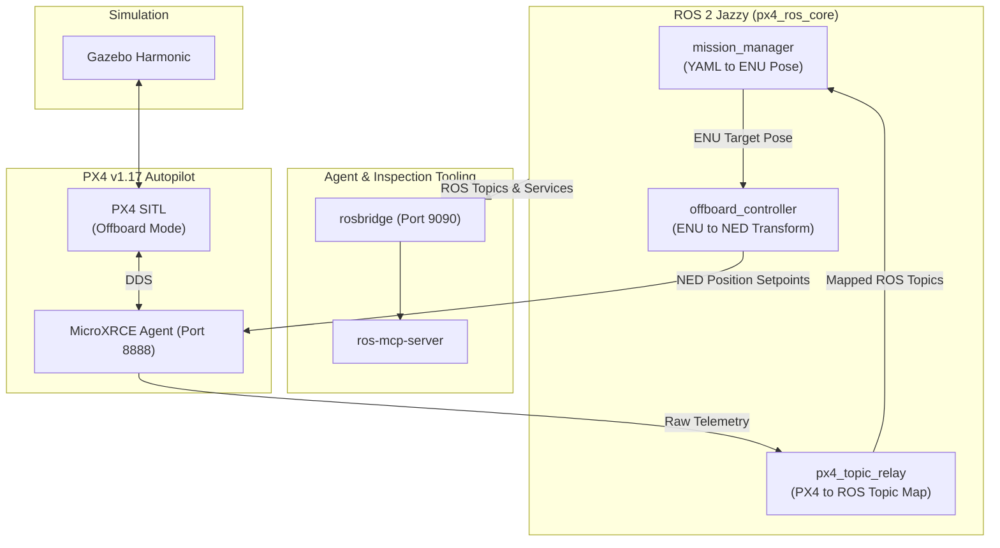

# ros-px4-template

A ROS 2 + PX4 + Gazebo project template with modern Python toolchains.

This repository provides a pre-configured template for rapid drone software development while still maintaining an organized, performant, and tested codebase.

## Core design principles

- **Stack**
  - Ubuntu 24.04 (native, [distrobox](https://distrobox.it), WSL)
  - ROS 2 Jazzy and Gazebo Harmonic
  - PX4 with Micro XRCE-DDS
    - Upstream PX4 Autopilot lives outside this repo (`PX4_DIR` in `.env`). Gazebo worlds and models go in `sim/`.
    - `src/px4_msgs` is pinned to branch `release/1.17` and never edited locally.
  - Python 3.12 with [uv](https://github.com/astral-sh/uv), [ruff](https://github.com/astral-sh/ruff), and [ty](https://github.com/astral-sh/ty)
  - [just](https://github.com/casey/just) for development workflows
  - [ros-mcp-server](https://github.com/robotmcp/ros-mcp-server) for live topic and service inspection via rosbridge
- All `src/` code is sim/hardware agnostic. Nothing under `src/` imports from `sim/` or `hardware/`.
- All internal coordinates follow [ROS REP-103](https://www.ros.org/reps/rep-0103.html) ENU frame. Conversion to and from PX4 NED happens only at the PX4 boundary in `offboard_controller` and `mission_manager`.
- Scenario integration tests in `tests/scenarios/` validate the capabilities of the current codebase. Verified milestones are recorded in `tests/capabilities.toml`.
- Live topics are checked against the defined topic manifest in [docs/TOPICS.md](docs/TOPICS.md) with `just check-topics` to prevent interface drift.
- Each node writes logs to `logs/<node>.jsonl`. After a run, `just log summary` (or `just log merge`) produces the compressed logs and `logs/run_summary.json`.

## Runtime architecture



## Quick start

1. Add PX4, ROS, and version paths to `.env` (adjust paths if yours differ):

```bash
echo -e 'PX4_DIR=/path/to/PX4-Autopilot\nROS_SETUP=/opt/ros/jazzy/setup.bash\nPX4_VERSION=v1.17.0\n' >> .env
```

2. Initialize and build:

```bash
just setup            # clones px4_msgs, uv sync, rosdep, and builds
```

3. Launch the full simulation stack:

```bash
just sim              # Gazebo (GUI), PX4 SITL, XRCE, ROS nodes, rosbridge
```

4. With the sim loaded, run a scenario and record the capability:

```bash
just test scenario --arg 01_arm_takeoff
just log cap mark arm_takeoff sim
```

5. Stop everything:

```bash
just sim stop
```

## Project structure

```
ros-px4-template/
├── src/
│   ├── core/
│   │   └── ros_px4_template_core/   # Core nodes, lib, bridges (sim/hardware agnostic)
│   │       ├── nodes/               # offboard_controller, mission_manager, px4_topic_relay, ...
│   │       ├── lib/                 # frame_transforms, mission_runtime, StructuredLogger
│   │       └── bridges/             # PX4 communication helpers
│   ├── px4_ros_msgs/                # Custom msgs (ControllerStatus, MissionStatus)
│   ├── px4_ros_sim/                 # Sim-only ROS helpers (not imported from core)
│   └── px4_msgs/                    # Upstream PX4 micro XRCE defs (release/1.17)
├── sim/                             # Gazebo worlds, models, sim_full.launch.py
├── hardware/                        # Serial FC + rosbridge; no Gazebo
├── config/
│   ├── params/                      # common, sim, hardware overlays
│   └── missions/                    # YAML missions (ENU meters)
├── tests/
│   ├── scenarios/                   # Live acceptance tests on a running graph
│   ├── unit/                        # Pure logic (no ROS graph)
│   └── capabilities.toml            # Verified capability registry
├── tools/                           # capabilities CLI, log merger, topic checker, ...
├── docs/                            # FRAMES, TOPICS, MCP, MISSIONS, ...
├── AGENTS.md                        # Agent operating guide (this repo)
├── justfile
└── pyproject.toml                   # uv, ruff, ty
```

## Everyday commands

| Command | Purpose |
|---------|---------|
| `just` | List all 5 workflows |
| `just setup` | One-time workspace setup (auto-detects PX4 version) |
| `just check` | Complete quality gate (formats, lints, typechecks, builds, unit tests) |
| `just sim` / `just sim headless` | Full simulation stack (auto-compiles and launches sim) |
| `just test scenario --arg <name>` | Run a scenario (e.g. `01_arm_takeoff`) |
| `just log summary` | Auto-merge and summarize log events/errors |
| `just log status` / `just log topics` | Show system JSON status or audit live topic graph |

## Docs

| Doc | Contents |
|-----|----------|
| [AGENTS.md](AGENTS.md) | Agent workflows, invariants, troubleshooting, logs |
| [docs/FRAMES.md](docs/FRAMES.md) | ENU / NED / body frames |
| [docs/TOPICS.md](docs/TOPICS.md) | Topic owners and types |
| [docs/MCP.md](docs/MCP.md) | rosbridge and ros-mcp-server |
| [docs/MISSIONS.md](docs/MISSIONS.md) | Mission phases and YAML schema |
