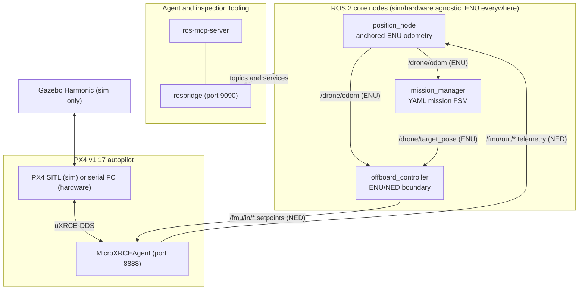
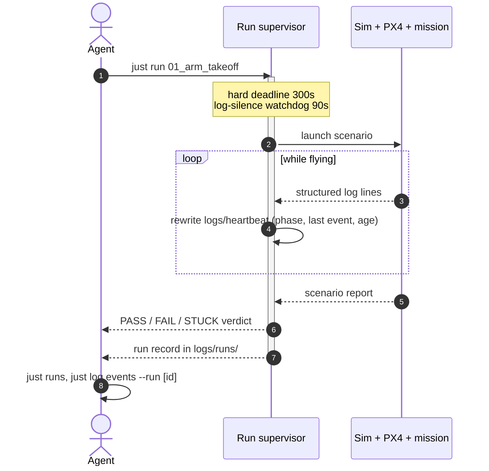

# ros-px4-template

A ROS 2 + PX4 + Gazebo template for autonomous drone development, built to be driven by coding agents as well as humans. Commands are bounded and report what they verified; missions are YAML state graphs; capabilities are tracked as claims tied to committed flight evidence.

Built on: Ubuntu 24.04 (native, [distrobox](https://distrobox.it), or WSL) - ROS 2 Jazzy - Gazebo Harmonic - PX4 v1.17 over Micro XRCE-DDS - Python 3.12 with [uv](https://github.com/astral-sh/uv), [ruff](https://github.com/astral-sh/ruff), [ty](https://github.com/astral-sh/ty) - [just](https://github.com/casey/just) task runner - [ros-mcp-server](https://github.com/robotmcp/ros-mcp-server) for live graph inspection.

## Design

- **Every command terminates and reports what it verified.** Launches wait with a timeout. Scenario runs execute under a supervisor with a hard deadline and a log-silence watchdog. A `READY`/`PASS` line prints only after post-conditions are confirmed, so a dead stack reports `NOT READY` instead of a false pass. This is what makes the stack drivable by an agent or CI without babysitting. The only unbounded command is `just log tail`.
- **Missions are YAML, not code.** A pure FSM engine interprets state graphs of registered behaviors and guards. A new mission is a new YAML file, validated in under a second without booting the sim. See [docs/MISSIONS.md](docs/MISSIONS.md).
- **Capabilities are claims with evidence.** `tests/capabilities.toml` declares what the system should do. Rungs (`declared < simulated < sim-flown`) are derived from committed PASS evidence and git history, never stored. Changing flight-relevant code marks the affected claims stale until re-flown. See [docs/CLAIMS.md](docs/CLAIMS.md).
- **One log for everything.** Every process (ROS nodes, PX4, Gazebo, the XRCE agent) streams to a single logfmt session log, so a run can be diagnosed with `rg` alone.
- **`src/` is sim/hardware agnostic.** The same nodes, topics, and missions run in Gazebo and on a serial flight controller; only the launch entry point differs.

## Runtime architecture



All application code runs in ENU ([REP-103](https://www.ros.org/reps/rep-0103.html)); conversion to PX4's NED happens only at the boundary nodes. See [docs/FRAMES.md](docs/FRAMES.md).

## The run contract

Scenario runs execute under a supervisor and always end in one of three verdicts:



| Verdict | Meaning | Where to look |
|---------|---------|---------------|
| `PASS` | Flew and met the scenario's criteria | The one-line verdict carries the real numbers (waypoint error, hold time) |
| `FAIL` | Flew, missed the criteria | Mission events: `just log events --run <id>` |
| `STUCK` | The stack or harness wedged | Stack log: `just log since` or `logs/latest.log` |

A verdict file is always written, even if the supervisor has to kill the run. Missions add their own inner layer: per-phase `phase_timeout` edges and a global `time_budget` safety edge mean a guard that never fires diverts to a safe hold instead of hovering forever.

## Quick start

1. Copy the environment template and edit paths for your machine:

   ```bash
   cp .env.example .env       # then edit .env: PX4_DIR, ROS_SETUP, PX4_VERSION
   ```

2. Initialize and build:

   ```bash
   just setup                 # clones px4_msgs, uv sync, rosdep, builds
   ```

3. Launch the full simulation stack (boots detached, returns after a READY verdict):

   ```bash
   just sim start             # Gazebo headless, PX4 SITL, XRCE, ROS nodes, rosbridge
   ```

4. Fly a scenario and record the capability:

   ```bash
   just run 01_arm_takeoff
   just cap record arm_takeoff
   ```

5. Stop everything:

   ```bash
   just stop                  # exhaustive cold teardown, no process survives
   ```

## Everyday commands

```bash
just                              # live status snapshot + where to go next
just setup                        # one-time setup (px4_msgs, uv, rosdep, build)
just check                        # format, lint, typecheck, build, unit tests
just sim start                    # boot headless sim detached, wait until ready, return
just sim start --gui              # same, with the Gazebo GUI
just stop                         # exhaustive cold teardown of the whole stack
just run <name>                   # one scenario, supervised (e.g. 01_arm_takeoff)
just e2e                          # full headless cycle (--detach for background)
just wait run                     # bounded wait on the active run/cycle (exit 3 = still going)
just runs                         # recent run records: id, verdict, reason, age
just log since                    # new log lines since your last call (events+errors)
just mission validate <name>      # validate a mission YAML in <1s, no sim
just cap show                     # print derived capability rungs
just cap plan [claim]             # print the dependency-first claims frontier
just cap record <claim>           # commit fresh PASS evidence after a scenario
just log summary                  # regenerate latest_summary.json
just log topics                   # audit live topics vs docs/TOPICS.md
just analyze                      # overlay+query the latest recorded run via skein
```

## Missions are data

A mission is a YAML state graph interpreted by a pure engine: each state names a behavior, each transition names a guard, and a `safety` tier outranks normal progression every tick. This is `search_relocalize` in full:

```yaml
mission:
  initial: takeoff
  safety:
    - {guard: estimate_invalid, to: hold_safe}
    - {guard: geofence_breach, params: {radius_m: 30.0}, to: return_to_origin}
    - {guard: time_budget, params: {budget_s: 300}, to: hold_safe}
  states:
    takeoff:          {behavior: hold, params: {z: 3.0}}
    search:           {behavior: search_lawnmower, params: {spacing_m: 8.0, legs: 2}}
    return_to_origin: {behavior: goto_origin, params: {z: 3.0}}
    done:             {behavior: hold}
    hold_safe:        {behavior: hold}
  transitions:
    - {from: takeoff, guard: armed_at_altitude, to: search}
    - {from: search,  guard: marker_stable, params: {id: 0, n: 5}, to: return_to_origin}
    - {from: search,  guard: search_complete, to: return_to_origin}
    - {from: return_to_origin, guard: reached, to: done}
  terminal: [done]
```

`just mission validate <name>` catches a misspelled behavior in under a second; `just mission sim <name>` ticks the real engine over a kinematic model to prove the graph terminates - both without booting Gazebo. Behaviors and guards are small pure functions registered by name; adding one is a function, a test, and a table row. See [docs/MISSIONS.md](docs/MISSIONS.md).

## The claims ladder

`tests/capabilities.toml` is a dependency DAG of capability claims. Each rung is derived, never stored:

```text
declared < simulated < sim-flown (stale) < sim-flown
```

`just cap show` prints every claim's rung and why; `just cap plan` prints the next action per incomplete claim; `just e2e` flies the whole roster in dependency order and auto-records evidence for every PASS. Editing flight-relevant code stales exactly the claims whose evidence it touches. See [docs/CLAIMS.md](docs/CLAIMS.md).

## Observability

Every process streams to one logfmt session log, `logs/latest.log` - each line is `t=<rel_s> src=<source> ...`:

```bash
just log since                            # only what appended since your last call
rg event=WAYPOINT_REACHED logs/latest.log # state transitions, greppable directly
rg -C 5 "t=42\." logs/latest.log          # everything that happened around t=42
```

`just log topics` audits the live graph against the topic manifest in [docs/TOPICS.md](docs/TOPICS.md) to prevent interface drift. `just sim start --record` captures a ROS bag plus the PX4 ULog for post-flight analysis with skein, a sibling-repo tool that reconciles the bag and ULog clocks onto one timeline (see [docs/SIM.md](docs/SIM.md)).

## Project structure

```
ros-px4-template/
├── src/
│   ├── core/
│   │   └── ros_px4_template_core/   # Core nodes + lib (sim/hardware agnostic)
│   │       ├── nodes/               # offboard_controller, mission_manager, position_node, ...
│   │       └── lib/                 # frames, mission/ engine, StructuredLogger
│   ├── px4_ros_msgs/                # Custom msgs (ControllerStatus, MissionStatus)
│   └── px4_msgs/                    # Upstream PX4 msg defs (pinned to release/1.17)
├── sim/                             # Gazebo worlds, models, sim_full.launch.py
├── hardware/                        # Serial FC + rosbridge; no Gazebo
├── config/
│   ├── params/                      # sim/hardware overlays
│   ├── paths/                       # ENU waypoint lists
│   └── missions/                    # mission YAML state graphs
├── tests/
│   ├── scenarios/                   # Live acceptance tests on a running graph
│   ├── unit/                        # Pure logic (no ROS graph)
│   ├── evidence/                    # Committed PASS evidence per claim
│   └── capabilities.toml            # Capability claim registry
├── tools/                           # run supervisor, log tooling, claims CLI, ...
├── docs/                            # FRAMES, TOPICS, MISSIONS, CLAIMS, ...
├── AGENTS.md                        # Agent operating guide
├── justfile                         # Task surface (wraps tasks.py)
└── tasks.py                         # CLI orchestrator
```

Upstream PX4 lives outside this repo (`PX4_DIR` in `.env`); Gazebo worlds and models belong in `sim/`. `src/px4_msgs` stays pinned to `release/1.17` and is never edited locally - enforced by `just check`.

## Docs

- [Agent workflows, invariants, troubleshooting](AGENTS.md)
- [ENU / NED / body frames](docs/FRAMES.md)
- [Topic owners, types, QoS](docs/TOPICS.md)
- [Mission phases and YAML schema](docs/MISSIONS.md)
- [Claims ladder and committed evidence](docs/CLAIMS.md)
- [Authoring a challenge from a rules doc](docs/CHALLENGES.md)
- [Simulation worlds, ArUco assets, run recording](docs/SIM.md)
- [Open ideas and known limits](docs/BACKLOG.md)
