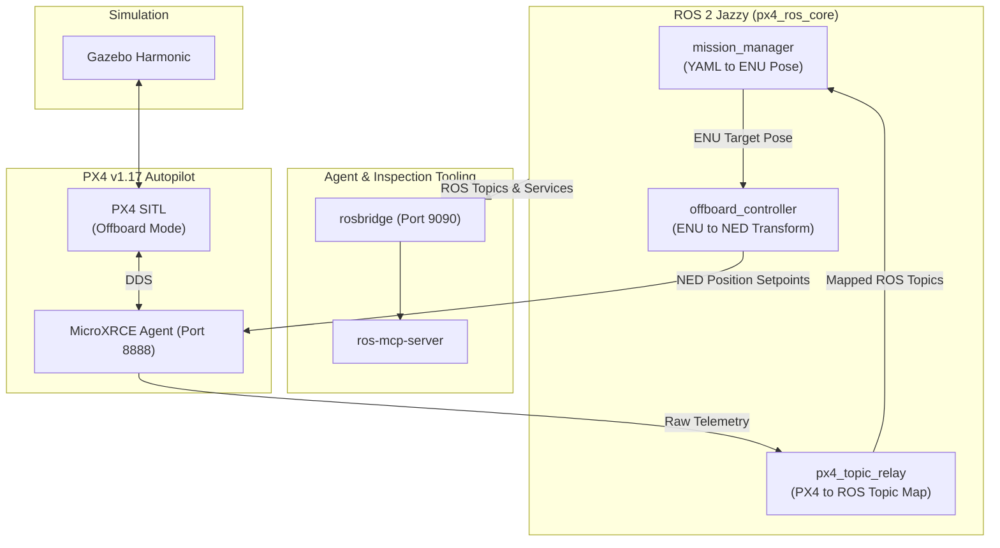

# ros-px4-template

This repository provides a pre-configured template for rapid drone software development while still maintaining an organized, performant, and tested codebase. 

## Core Design Principles

- Stack
  - Ubuntu 24.04 (Native, [distrobox](https://distrobox.it), WSL)
  - ROS 2 Jazzy & Gazebo Harmonic
  - PX4 with Micro XRCE-DDS
    - Repo pinned to `release/v1.17` and *never* edited locally. Gazebo worlds and models go in `sim/`.
  - Python 3.12 with [uv](https://github.com/astral-sh/uv) package manager, [ruff](https://github.com/astral-sh/ruff) linter, and [ty](https://github.com/astral-sh/ty) type checker
  - [just](https://github.com/casey/just) for development workflows
  - [ros-mcp-server](https://github.com/robotmcp/ros-mcp-server) for live topic/service inspection via `rosbridge`.
- All `src/` code is sim/hardware agnostic and do. Nodes and libraries in ros_px4_core do not import from sim/ or hardware/.
- All internal coordinates are in [ROS REP-103](https://www.ros.org/reps/rep-0103.html) ENU (East-North-Up). Frame transformation to and from PX4-native NED (North-East-Down) occurs exclusively at the `offboard_controller` I/O.
- Scenario-based integration tests in `tests/scenarios/` evaluate the live code and find capability regressions. Successfully validated system milestones are recorded in `tests/capabilities.toml`.
- Live topics are validated against a schema manifest in `docs/TOPICS.md` using `just check-topics` to prevent interface drift.
- TODO: something about merge logs

## Runtime architecture



## Quick start

Add your PX4, ROS, PX4 version, and PX4 message environment variables. If they are different, change them in this command.
```bash
echo -e 'PX4_DIR=/path/to/PX4-Autopilot\nROS_SETUP=/opt/ros/jazzy/setup.bash\nPX4_VERSION=v1.17.0\nPX4_MSGS_BRANCH=release/1.17' >> .env
```

Copy the example environment file and configure PX4_DIR to point to your PX4-Autopilot repository. [TODO: append and remove .env.example. have it be a single line command]

Run `just` from your Ubuntu 24.04 environment.

Copy [.env.example](.env.example) to `.env` and set `PX4_DIR` to your PX4-Autopilot clone before `just sim`.

```bash
cp .env.example .env
just clone-px4-msgs    # once
just setup             # uv sync + colcon build
just sim               # full stack (GUI); or: just sim-headless
```

Give SITL a few minutes after launch (PX4 boot, EKF2, preflight). Then:

```bash
just scenario 01_arm_takeoff
just mark-capability arm_takeoff sim
```

**Headless / CI:** `just sim-headless` · **Stop:** `just sim-stop`

**Inspect / ArUco:** `just demo-inspect` (sim + vision) or `just sim-inspect` (sim only) — [docs/MISSIONS.md](docs/MISSIONS.md)

## Project structure

```
ros-px4-template/
├── src/
│   ├── px4_ros_core/          # Application: nodes, lib/, bridges/
│   │   ├── nodes/             # offboard_controller, mission_manager, px4_topic_relay, …
│   │   ├── lib/               # frame_transforms, mission_runtime, StructuredLogger, …
│   │   └── bridges/           # PX4-specific glue (kept thin)
│   ├── px4_ros_msgs/          # Custom messages (ControllerStatus, MissionStatus, …)
│   └── px4_msgs/              # Upstream PX4 interfaces (cloned, branch release/1.17)
├── sim/                       # Worlds, models, sim_full.launch.py (Gazebo + PX4 + agents)
├── hardware/                  # hardware.launch.py — rosbridge + core nodes only
├── config/
│   ├── params/                # common.yaml, sim.yaml, hardware.yaml (layered)
│   └── missions/              # YAML missions (ENU waypoints)
├── tests/
│   ├── scenarios/             # Live acceptance (asyncio)
│   ├── unit/                  # Pure lib tests (no ROS graph)
│   └── capabilities.toml      # Verified capabilities registry
├── tools/                     # capabilities CLI, log merger, GCS heartbeat, topic checker
├── docs/                      # FRAMES, TOPICS, MCP, MISSIONS, BACKLOG
├── justfile                   # sim, build, check, scenarios, logs
└── pyproject.toml             # uv + ruff + ty (not a ROS package)
```

**Launch split:** `sim/launch/` — Gazebo, PX4 SITL, MicroXRCE, clock bridge, optional vision, core nodes. `hardware/launch/` — rosbridge + same core nodes for a real FCU. No `/clock` → use full `just sim`, not hardware-only launch.

**Config layering:** `config/params/common.yaml` plus `sim.yaml` / `hardware.yaml` overrides; missions in `config/missions/*.yaml` (ENU meters).

## Everyday commands

| Command | Purpose |
|---------|---------|
| `just` / `just --list` | All recipes (aliases: `s`→sim, `b`→build, `hw`→hardware) |
| `just build` | `colcon` with symlink install |
| `just check` | ruff + ty + unit tests + invariant checks (no ROS running) |
| `just sim` / `just sim-headless` | Full simulation stack |
| `just hardware` | Rosbridge + core nodes (real vehicle) |
| `just scenario <name>` | Run `tests/scenarios/<name>.py` against live graph |
| `just capabilities` | Show / edit capability status |
| `just mark-capability <id> sim` | Record a passed scenario |
| `just check-topics` | Compare live topics to `docs/TOPICS.md` (sim up) |
| `just merge-logs` | Merge JSONL → `logs/merged.jsonl` + `run_summary.json` |

## Docs
- [AGENTS.md](AGENTS.md)
- [ENU / NED / body frames](docs/FRAMES.md)
- [Topic owners and types](docs/TOPICS.md)
- [ROS MCP server](docs/MCP.md)
