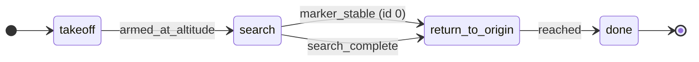

# Missions

A mission is **data, not code**: a YAML graph of *states* and *transitions* that a tiny pure engine (`lib/mission/engine.py`) reads one tick at a time. Each state names a **behavior** (what to do); each transition names a **guard** (when to move). Behaviors and guards are small pure functions registered by name, so a new mission is usually just a new YAML file - no node changes.

| Piece | Where |
|-------|-------|
| Engine + library | `src/core/ros_px4_template_core/lib/mission/` |
| Mission files | `config/missions/*.yaml` |
| Runner node | `mission_manager` (`nodes/mission_manager.py`) |

## Select a mission

`mission_manager` reads the `mission_file` parameter (relative to the project root). Point it at a mission via a params overlay, e.g. `config/params/overlays/search_relocalize.yaml`:

```yaml
offboard_controller:
  ros__parameters:
    auto_arm: true
mission_manager:
  ros__parameters:
    mission_file: "config/missions/search_relocalize.yaml"
```

## File format

```yaml
mission:
  initial: <state name>           # state the engine starts in
  safety:                         # optional global transitions, see FSM semantics
    - {guard: <name>, params: {...}, to: <state>}
  states:
    <name>: {behavior: <name>, params: {...}}
    ...
  transitions:                    # per-state transitions
    - {from: <state>, guard: <name>, params: {...}, to: <state>}
    ...
  terminal: [<state>, ...]        # optional; states with no outgoing mission edges
```

Top-level document fields:

| Field | Type | Required | Meaning |
|-------|------|----------|---------|
| `requires` | list of claim ids | no (default `[]`) | Claims from `tests/capabilities.toml` that must reach `sim-flown` before this mission is considered ready. Shape-checked at load; `just mission validate` cross-checks ids and warns on rungs below `sim-flown`. |

The loader (`lib/mission/loader.py`) validates the document up front and raises `MissionError` for an unknown behavior, guard, initial state, or transition target - a malformed mission fails at startup, not in mid-flight.

## Three verification tiers, fastest first

| Tier | Command | Proves | Cost |
|------|---------|--------|------|
| Parse | `just mission validate <name>` | The YAML loads: names resolve, targets exist | <1s, no ROS |
| Graph | `just mission sim <name>` | The graph *progresses*: real engine ticked over a crude kinematic model reaches a terminal state | <1s, no ROS |
| Flight | `just run <name>` | It actually flies | Gazebo + PX4 boot |

```bash
just mission list                 # every config/missions/*.yaml with its description
just mission validate <name>      # OK / FAIL with the exact loader error; exit 2 on failure
just mission show <name>          # states, transitions, and terminal set
just mission sim demo             # phase trace + verdict; exit 0/1
```

`just mission validate hover` runs the identical loader `mission_manager` uses at runtime, so a misspelled behavior shows here instead of after a 16–30 s sim start. `just mission sim` output looks like:

```
tick   0.0s  takeoff
tick   1.5s  takeoff -> follow  (armed_at_altitude)
tick  16.5s  follow -> done  (waypoints_done)
OK demo: terminated in done after 16.6 sim-s (166 ticks)
```

Exit 0 when the mission terminates (or reaches steady state for a terminal-less mission), exit 1 on a stall (a guard that never fires - the "stuck in `takeoff`" bug an agent needs to see), exit 2 on a load error. Marker missions get a marker auto-planted directly below the drone so their guards fire.

Caveat: `mission sim` verifies GRAPH LOGIC (transitions, guards, stalls), NOT flight dynamics. The straight-line kinematic model has no control, estimation, or physics; the live scenario tier remains the flight gate.

## Editor schema

Each `config/missions/*.yaml` starts with a `# yaml-language-server: $schema=...` directive pointing at `schemas/mission.schema.json`, so a schema-aware editor autocompletes `behavior` and `guard` names and flags structural mistakes as you type. The schema is generated from the registry, never hand-edited: regenerate with `just mission schema > schemas/mission.schema.json` whenever a behavior or guard is added or removed. A unit test fails if the committed file drifts from the registry.

## FSM semantics (a real FSM, not a switch statement)

Each tick (`tick_rate_hz`, default 10 Hz) the engine:

1. Builds an **immutable `Inputs` snapshot** (pose, arm/altitude/estimate flags, detections, input ages). Behaviors and guards only ever see this snapshot, so a value cannot change underneath them mid-tick - this is what keeps transitions race-free.
2. Runs the **current state's behavior** to produce a `Command` (`GoTo` / `Hold` / `Land`) and a dict of **signals**.
3. Evaluates the **`safety` tier first** (every tick, from any state, including terminal states), then - only if the current state is not terminal - the per-state **`transitions`** whose `from` matches the current state.
4. Fires **at most one transition per tick** (first matching guard wins, in file order; safety always outranks mission transitions). On a fire it logs a structured `TRANSITION` event (from, to, guard, trigger values), clears the scratch of both states so the new state enters fresh, and re-runs the new state's behavior so the entry command is emitted the same tick.

Because `safety` is checked before the per-state edges, a hazard always wins over normal progression: while flying a lawnmower `search`, a `geofence_breach` diverts to `return_to_origin` instead of continuing the pattern.

A safety (or mission) edge whose target IS the current state does not re-enter it. While the condition holds, the engine leaves the state, scratch, and event log untouched, so a `hold_safe` freezes its target where the fault occurred rather than capturing the drifting live pose again each tick. A persisting safety condition also keeps the mission tier suppressed, so a `hold_safe -> resume` edge only fires once the condition itself clears.

**Terminal states**: states listed in `terminal` have no outgoing **mission** transitions evaluated, but the **safety** tier still runs - a terminal `done` that holds position will still change to a safe state if the estimate goes invalid.

**Bounding the mission**: shipped missions put a `phase_timeout` edge on every state that can stall (to `hold_safe`) and a `time_budget` safety edge as the global ceiling. Together with the run supervisor above them, a guard that never fires ends in a safe hold and a verdict, never an infinite hover. Both edges belong LAST in their list so real progression wins first.

## Behaviors

`lib/mission/behaviors.py` registers each behavior. Each one returns a command plus signals (guards read them). `params` keys and defaults:

| Behavior | params (default) | Signals emitted |
|----------|------------------|-----------------|
| `hold` | `x`,`y`,`z` (current pose at entry), `yaw_deg` (optional, ENU degrees, latched at entry), `tolerance_m` (0.4) | `reached` |
| `follow_waypoints` | `waypoints` (list of `[x,y,z]` or `[x,y,z,yaw_deg]`) **or** `path_file` (YAML path, resolved to waypoints by the loader), `tolerance_m` (0.4), `hold_s` (2.0) | `reached`, `waypoints_done`, `waypoint_index` |
| `search_lawnmower` | `center` (`[0,0]`), `spacing_m` (2.0), `legs` (4), `altitude_m` (3.0), `hold_s` (0.0) | `search_complete` |
| `center_on_marker` | `target_id`, `altitude_m` (current z), `tolerance_m` (0.4), `hold_s` (10.0) | `centering_error`, `centered`, `hold_complete` |
| `center_land` | `target_id`, `tolerance_m` (0.3), `descent_rate_m_s` (0.4), `land_altitude_m` (0.7), `min_altitude_m` (0.3), `marker_fresh_s` (1.0, freshness window for the selected detection), `max_dt_s` (0.5, clamps the per-tick descent-integration time delta to `[0, max_dt_s]`) | `centering_error`, `centered`, `marker_lost` (detection stale/missing -- altitude is frozen, not descending; forced `false` once `Land` is latched, since PX4 owns the final descent and the marker leaves view near touchdown), `land_commanded` |
| `goto_origin` | `z` (current z), `tolerance_m` (0.5) | `reached` |

`path_file` is resolved relative to the project root and may be used anywhere `follow_waypoints` accepts `waypoints`.

The signal name `state_elapsed_s` is reserved: the engine injects it every tick (seconds since the current state was entered) and behaviors must not set it.

## Guards

`lib/mission/guards.py` registers each guard. Each one is a pure predicate over the snapshot (and, for the signal guards, the current behavior's signals).

| Guard | params (default) | True when |
|-------|------------------|-----------|
| `armed_at_altitude` | — | vehicle armed **and** at/above takeoff altitude |
| `waypoints_done` | — | behavior signalled `waypoints_done` |
| `reached` | — | behavior signalled `reached` |
| `hold_complete` | — | behavior signalled `hold_complete` |
| `search_complete` | — | behavior signalled `search_complete` |
| `marker_fresh` | `id`, `t` (1.0) | a detection of `id` is newer than `t` s |
| `marker_stable` | `id`, `n` (5) | `id` seen on ≥ `n` consecutive fresh detections |
| `marker_lost` | `id`, `t` (3.0) | no detection of `id` within `t` s |
| `geofence_breach` | `radius_m` (50.0) | horizontal distance from origin ≥ `radius_m` |
| `altitude_ceiling` | `ceiling_m` (required, > 0) | ENU z is at/above `ceiling_m`; intended for safety-tier transitions |
| `time_budget` | `budget_s` (required, > 0) | armed mission time exceeds `budget_s`; intended for safety-tier transitions |
| `phase_timeout` | `timeout_s` (required, > 0) | time in the current state exceeds `timeout_s`; reads the engine-injected `state_elapsed_s` signal; intended for per-state mission-tier edges |
| `keep_out_box` | `x_min`, `x_max`, `y_min`, `y_max` (required); `z_min`, `z_max` (optional) | vehicle is inside or on the boundary of the axis-aligned ENU box; intended for safety-tier transitions |
| `estimate_invalid` | — | the state estimate is not OK |
| `inputs_stale` | `key` (`odom`), `t` (1.0) | named input older than `t` s |
| `battery_low` | `frac` (0.2), `max_age_s` (5.0) | battery is connected, fresh (age <= `max_age_s`), and remaining fraction <= `frac` |
| `failsafe_active` | — | PX4 reports `VehicleStatus.failsafe` true (logical mirror only, see warning below) |
| `disarmed` | — | vehicle is not armed |
| `marker_lost_signal` | — | the current state's behavior signalled `marker_lost` (e.g. `center_land` on detection staleness/loss) |

For `marker_*` guards, omitting `id` matches any marker.

`marker_lost_signal` reads the exact freshness decision the behavior made this tick (via its `marker_lost` signal), rather than recomputing freshness from `inputs.detections` independently the way the inputs-only `marker_lost` guard does - this keeps a descend-episode's own staleness judgment and its mission transition from ever disagreeing.

An unknown, disconnected, or stale battery reading never trips `battery_low` - it fails toward "don't know", not "low". Combine `battery_low` with `inputs_stale` (`key: battery`) if a competition or hardware policy requires fail-closed behavior when battery telemetry itself goes stale.

**`battery_low` changes the mission; it does not touch arming or offboard mode.** Example: change to `return_to_origin` at 20%:

```yaml
safety:
  - {guard: battery_low, params: {frac: 0.2}, to: return_to_origin}
```

**Warning: `failsafe_active` is logical observability only.** PX4 remains the sole failsafe authority - a mission transition on this guard (e.g. to a `hold`) does not command, override, or interrupt whatever recovery mode PX4 itself selected. Do not model `failsafe_active -> hold_safe` as if the mission holding position overrides PX4; it does not. Separately, on the rising edge of a live PX4 failsafe, `offboard_controller` latches its own automatic arm/mode commands off (existing `OffboardControlMode`/setpoint streaming keeps running); it will not re-request OFFBOARD until an operator explicitly sets `auto_arm=true` after PX4 reports the failsafe has cleared.

## Yaw commands

`hold` and `follow_waypoints` accept an optional `yaw_deg` (ENU degrees, 0 = East, positive counter-clockwise). Omitting it means heading is uncontrolled: PX4 holds whatever heading it already has. When set, `GoTo.yaw` carries the value as ENU radians through `mission_manager` to `offboard_controller`, which is the only place ENU yaw is converted to PX4 NED heading (the `yaw` field of `/fmu/in/trajectory_setpoint`).

On the wire, the orientation quaternion of `/drone/target_pose` is the optional-yaw contract: the all-zero quaternion is the internal sentinel for "yaw omitted" (the identity quaternion is a real ENU yaw of zero, so it cannot double as the sentinel); any other finite, near-unit quaternion is a commanded ENU yaw. See `lib/target_pose.py` for the codec.

## Vision relocalization

When launched with `vision=aruco`, `aruco_pose_publisher` publishes `/drone/marker_detection` and `marker_localizer` turns a detection of a **known** marker (mapped in `config/markers.yaml`) into a `/drone/pose_override` (`PoseStamped`). `position_node` applies that fix to the published `/drone/odom` when it is fresh and within a jump bound - a known marker can correct drift without a bad fix moving the vehicle in one large jump. Missions consume the corrected pose transparently; the `search_relocalize` mission demonstrates the full loop.

## Precision landing and the reacquire pattern

`config/missions/precision_land.yaml` shows `center_land`: approach a marker, center over it, descend while centered, and hand off to PX4's own `NAV_LAND` (mission emits `Land`; `mission_manager` publishes `/drone/land_command` once per landing episode; `offboard_controller` sends `VEHICLE_CMD_NAV_LAND` and latches its own OFFBOARD/arm commands off for the duration - an independent latch reason alongside the disarm and failsafe latches, all three combined by `offboard_fsm.auto_arm_allowed`).

The graph adds a `reacquire` state so a lost or never-stable marker never turns into a descent with no marker in view:

- `approach` enters `descend` only on a **stable** marker observation (`marker_stable`); reaching the approach waypoint without one goes to `reacquire` instead.
- `descend` reverts to `reacquire` when `center_land` signals `marker_lost` (via the `marker_lost_signal` guard). The commanded altitude freezes at the moment of loss - it never climbs back - while `reacquire` holds the current pose.
- `reacquire` returns to `descend` once the marker is stable again. Because the engine clears a state's scratch on every transition (see FSM semantics), re-entering `descend` re-derives its descent from the vehicle's CURRENT altitude, not the frozen value from the previous episode.
- `descend` reaches `done` on `disarmed`: PX4's own AUTO_LAND disarms the vehicle; the mission only observes that. Once `Land` is latched (hand-off sent), `center_land` stops signalling `marker_lost` - the marker inevitably leaves view near touchdown and PX4 owns the descent, so a post-hand-off loss must not divert back to `reacquire`.

`Land` is emitted once per landing episode; the publish latch of `mission_manager` resets whenever a `GoTo` resumes (e.g. a `reacquire` detour), so a later episode issues a fresh `/drone/land_command`.

## Add a behavior or guard

1. Write a pure function in `behaviors.py` / `guards.py` and decorate it with `@behavior("name")` / `@guard("name")`. Behaviors take `(scratch, inputs, params)` and return `BehaviorResult(command, signals)`; guards take `(inputs, signals, params)` and return `bool`.
2. Add a unit test in `tests/unit/test_mission_behaviors.py` / `test_mission_guards.py`.
3. Reference it by name from a mission YAML. The loader validates the name on load.
4. Regenerate the editor schema: `just mission schema > schemas/mission.schema.json` (a unit test fails if the committed file drifts from the registry).
5. Add a row to the Behaviors / Guards table above (a unit test enforces this too).

## Topics

| Topic | Role |
|-------|------|
| `/drone/mission_status` | Current phase (= engine state name) |
| `/drone/target_pose` | Setpoint to `offboard_controller` |
| `/drone/marker_detection` | Metric marker detections (vision) |
| `/drone/pose_override` | Known-marker relocalization fix |

Full manifest: [docs/TOPICS.md](TOPICS.md).

## Example: `search_relocalize.yaml`

Mission-tier progression (the safety tier - `estimate_invalid` and `inputs_stale` to `hold_safe`, `geofence_breach` to `return_to_origin` - can fire from ANY of these states, every tick):



```yaml
mission:
  initial: takeoff
  safety:
    - {guard: estimate_invalid, to: hold_safe}
    - {guard: inputs_stale, params: {t: 1.0}, to: hold_safe}
    - {guard: geofence_breach, params: {radius_m: 30.0}, to: return_to_origin}
  states:
    takeoff:          {behavior: hold, params: {z: 3.0}}
    search:           {behavior: search_lawnmower, params: {center: [0.0, 0.0], spacing_m: 8.0, legs: 2, altitude_m: 3.0}}
    return_to_origin: {behavior: goto_origin, params: {z: 3.0}}
    done:             {behavior: hold}
    hold_safe:        {behavior: hold}
  transitions:
    - {from: takeoff,          guard: armed_at_altitude,                    to: search}
    - {from: search,           guard: marker_stable, params: {id: 0, n: 5}, to: return_to_origin}
    - {from: search,           guard: search_complete,                      to: return_to_origin}
    - {from: return_to_origin, guard: reached,                              to: done}
  terminal: [done]
```

## Scenario coverage

| Scenario | Needs |
|----------|--------|
| `03_waypoint` | Default sim (`follow_waypoints` mission, no vision) |
| `05_aruco_hover` | `vision=aruco` (`marker_hover` mission) |
| `06_search_relocalize` | `vision=aruco` (`search_relocalize` mission + `marker_localizer`) |
| `07_yaw_control` | Overlay `yaw_demo` (`yaw_demo` mission, no vision) |
| `08_precision_land` | `vision=aruco`, overlay `precision_land` (`precision_land` mission) |
