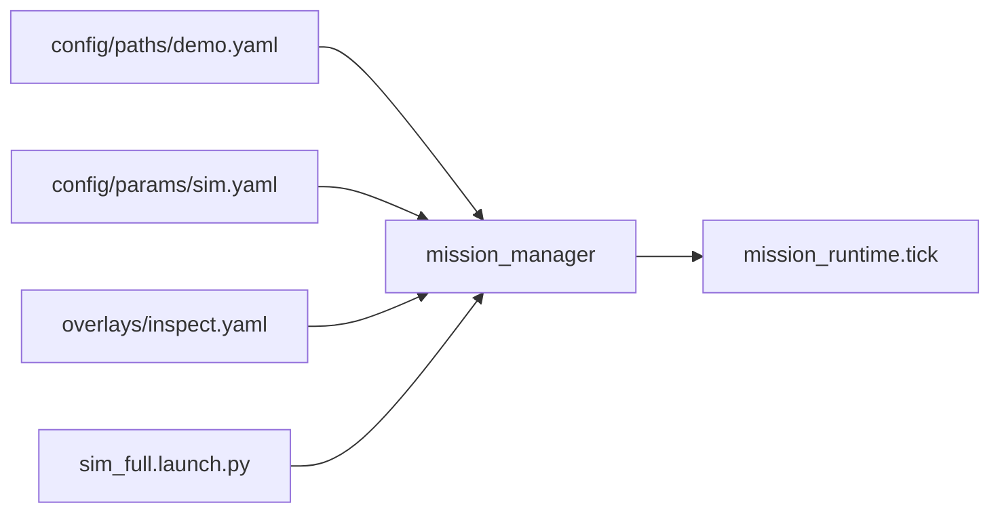

# Missions

A **mission** in this template is not a YAML file. It is a **launch recipe + param profile** running a shared navigation **routine** in code (`lib/mission_runtime.tick()`). Geometry lives in path files only.

## Three layers

| Layer | Where | Example |
|-------|--------|---------|
| **Path** | `config/paths/*.yaml` | `demo.yaml` — ENU points only |
| **Profile** | `config/params/*.yaml` + overlays | `path_file`, `enable_marker_hover`, tolerances |
| **Routine** | `lib/mission_runtime.py` | `follow_path` → optional `hover_marker` → `done` |

**Composition** (vision, world, future pose backends) is chosen in **launch** and `just` recipes, not in path files.



## Path files

`config/paths/demo.yaml`:

```yaml
- {x: 0.0, y: 0.0, z: 3.0}
- {x: 5.0, y: 0.0, z: 3.0}
- {x: 8.0, y: 0.0, z: 3.0}
```

A `waypoints:` wrapper is also accepted. Paths contain **no** marker settings, tolerances, or takeoff logic.

## Mission profiles (ROS params)

Default sim (`config/params/sim.yaml`):

```yaml
mission_manager:
  ros__parameters:
    path_file: "config/paths/demo.yaml"
    enable_marker_hover: false
    takeoff_altitude_m: 3.0
    tolerance_m: 0.4
    hold_s: 2.0
```

Inspect overlay (`config/params/overlays/inspect.yaml`) — same path, marker phase enabled:

```yaml
mission_manager:
  ros__parameters:
    enable_marker_hover: true
```

Hover-only: set `path_file: ""` (see `config/params/mission.yaml`).

| Param | Meaning |
|-------|---------|
| `path_file` | Path to `config/paths/*.yaml`; empty = hover at `takeoff_altitude_m` |
| `enable_marker_hover` | After path (or early acquire), run `hover_marker` using `/vision/marker_pose` |
| `takeoff_altitude_m` | Gate before `follow_path` |
| `tolerance_m`, `hold_s` | Waypoint reach criteria |
| `marker_*` | Debounce and hold when marker hover is enabled |

## Phases

| Phase | Meaning |
|-------|---------|
| `wait_arm_altitude` | Hold until armed and at/above `takeoff_altitude_m` |
| `follow_path` | Visit each path point (tolerance + hold time) |
| `hover_marker` | Track marker + offset (only if `enable_marker_hover`) |
| `done` | Complete |

Events: `PHASE_CHANGE`, `WAYPOINT_REACHED`, `MARKER_ACQUIRED`, `MARKER_LOST`, `MISSION_DONE`.

## Running demos

```bash
just sim                                    # path_demo profile (default)
just sim inspect                            # + inspect overlay + vision + inspect world
just test scenario --arg 03_waypoint        # path following (default sim)
just test scenario --arg inspect_aruco      # needs just sim inspect
uv run tasks.py rviz --config inspect       # RViz for inspect
```

## Topics

| Topic | Role |
|-------|------|
| `/drone/mission_status` | Phase, waypoint index |
| `/drone/target_pose` | Setpoint to `offboard_controller` |
| `/vision/marker_pose` | Sim detector when vision enabled |

Full manifest: [docs/TOPICS.md](TOPICS.md).

## Pose (`/drone/pose_enu`)

Mission logic reads **one** canonical topic. Launch picks the backend:

| Context | Node | Source |
|---------|------|--------|
| `just sim` | `sim_pose_adapter` | Gazebo `/world/<w>/model/<model>_0/pose` → ENU |
| Hardware / `just sim hardware` | `px4_pose_adapter` | PX4 `/fmu/out/vehicle_local_position` → ENU |

`offboard_controller` still uses PX4 directly for closed-loop control. Future ZED/lidar missions publish `/drone/pose_enu` from an external node (see `missions/README.md`).

Optional wrapped launch: `ros2 launch missions/inspect/launch/inspect.launch.py` (same as `just sim inspect`).

## Adding a mission

1. Add `config/paths/<name>.yaml` (points only).
2. Add or extend a param overlay (`enable_marker_hover`, tolerances, `path_file`).
3. Add launch extras if needed (vision, sensors) in `sim_full` or a future `missions/<name>/launch/`.
4. Add `tests/scenarios/<NN>_<name>.py` and a row in `tests/capabilities.toml`.

## Scenario coverage

| Scenario | Needs |
|----------|--------|
| `03_waypoint` | Default sim (`path_file` + no marker) |
| `inspect_aruco` | `just sim inspect` (`enable_marker_hover` + vision) |
